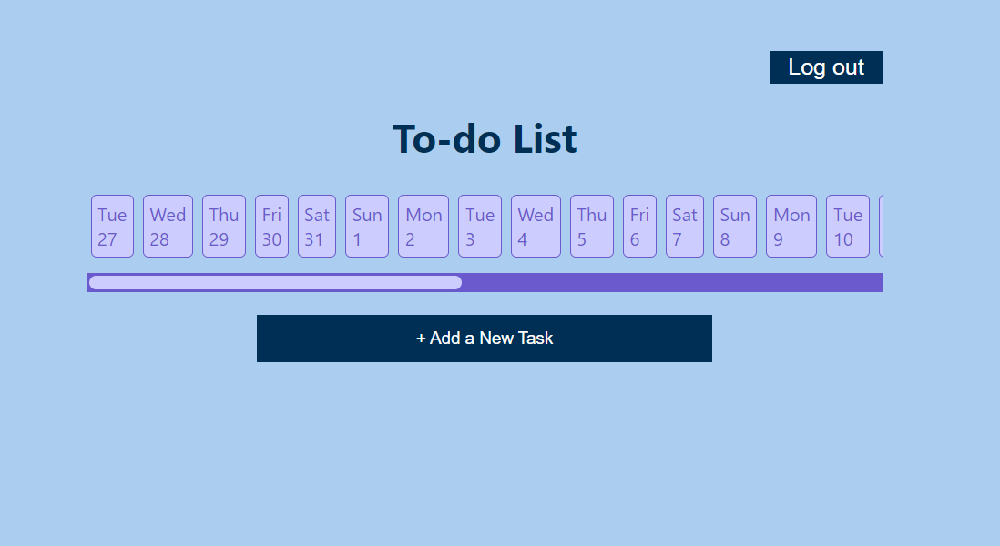
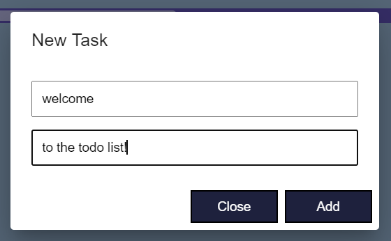
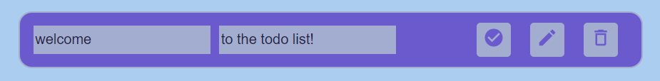

# [Task](https://mail.google.com/mail/u/0/?zx=y5zceiobh3gg#chat/space/AAAAg3mEYtY)

# How to run the app

First of all you should clone this repository (run in your code terminal the command 
`git clone https://github.com/lerarozhentseva/clever-todo-list.git`).
Then run following commands:
`npm install` (to install all packages), `cd my-app` (to do to the project folder), `npm start`.
The project will start on http://localhost:3000/

# About project

**TodoList** is a convenient application for recording tasks for every day for a mounth.
The user can both register and log in to the application (there are two corresponding forms for this).

When you entered your data, you emmidiately go to the main page of the application. 

The button <LogOut> allows you to log out from your account.
The button <+Add New Task> allows you to add new task for a day.

!! You must select the date of the task and then create it !!

To create the task, you should fill out the form and click button <Add>

After that a new task is created, which you can delete, change or transfer to the status completed.
To change the value of the task, you need to move the mouse cursor over the name, click on it,
overwrite the value in the input field and click on the pencil icon. 

# Database Snapshot
* **_Firebase Authenticition_** was used for registration and authorisation.
* **_Firebase Database_** was used for the record the to-do tasks.

Database structure:
* users
  * user1
    * todo1
      * completed: 'false'
      * creator: user1.email
      * date: 2022-12-27
      * title: 'welcome'
      * description: 'to the todo list!'
      * id: uniqueId(number)
    * todo2...
  * user2...
  * ...
      
# Application Stack 
* Firebase (used for authentication and data)
* Material UI (used for alerts, icons on buttons, modal windows)
* Redux (used for registrations)
* Moment (used for getting time)

# Folder Structure 

* node_modules (all downloaded packages)
* public (html & others files)
* src (source files)
  * components (reusable components)
  * pages
    * HomePage (css file and file of the main page) 
    * LoginPage (css file and file of the login page)
    * RegistrationPage (css file and file of the registration page)
    * TodoPage
      * Todo (css file and files for adding new Task)
      * TodoPage file and css
      * Date file
  * store (redux files, actions, reducers)
  * App.js
  * index.js
  * index.css (file with colors for light and  dark theme)
  * App.css (background style for all project)
